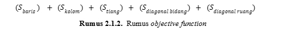

<h1 align="center">
  <br>
  Tugas Besar 1 IF3170 Inteligensi Artifisial 

  <br>
  <br>
</h1>

<h2 align="center">
  <br>
  Pencarian Solusi Diagonal Magic Cube dengan Local Search
  <br>
  <br>
</h2>


## Penjelasan Tugas
Proyek ini bertujuan untuk mengimplementasikan tiga algoritma local search (Steepest-ascent, Simulated Annealing, dan Genetic Algorithm) untuk menyelesaikan permasalahan Diagonal Magic Cube berukuran 5x5x5. Setiap algoritma diterapkan untuk mengoptimalkan konfigurasi angka dalam kubus sehingga memenuhi kriteria “magic number” di setiap baris, kolom, dan diagonal.
Objective functionharus mengukur seberapa jauh setiap aspek dari kubus dalam memenuhi magic number. Nilai dihitung melalui selisih objective value saat ini (penjumlahan current state) dengan objective value yang diharapkan, yaitu 315. Penghitungan objective value saat ini harus memenuhi syarat magic cube, Jumlah angka pada setiap baris, kolom, dan tiang
Jumlah diagonal bidang, baik horizontal maupun vertikal
Jumlah diagonal ruang antar sudut pada kubus
Objective function akhir adalah jumlah dari semua selisih yang telah dijumlahkan. Selisih ditulis dengan simbol S. Jadi, total objective function-nya dapat dituliskan sebagai, 
(Sbaris ) + (Skolom)+ (Stiang)+ (Sdiagonal bidang)+ (Sdiagonal ruang)      
Semakin kecil nilai objective function, semakin baik solusi tersebut, karena itu menunjukkan bahwa semua baris, kolom, tiang, dan diagonal semakin mendekati magic number (315).

## Objective Function
<div align="center">

</div>


## Melakukan *Cloning* 

1. Lakukan *clone repository*
```sh
  $ git clone https://github.com/jijiau/TugasBesar-IF3070DasarAI.git
```
2. Buka folder hasil *clone*
```sh
  $ cd TugasBesar-IF3070DasarAI
```
3. buka folder dan src folder
```sh
  $ cd "Unity"
```
4. Jalankan DAI.exe program code
```sh
  $ click DAI.exe untuk menjalankan program unity
```

## Pembagian Tugas
| Nama (NIM) | Tugas |
| ------------- | ------------- |
| Jihan Aurelia (18222001)  | Genetic Algorithm |
| Nasywaa Anggun Athiefah (18222021)  | Genetic Algorithm  |
| Ricky Wijaya (18222043)  | Simulated Annealing  |
| Muhammad Adli Arindra (18222089)  | Steepest Ascent Hill Climbing with Sideways Move , Membuat bonus, Membuat Unity|

## Reference 
Brownlee, J. (2021, October 12). Stochastic Hill Climbing in Python from Scratch - MachineLearningMastery.com. Machine Learning Mastery. Retrieved October 2, 2024, from 
https://machinelearningmastery.com/stochastic-hill-climbing-in-python-from-scratch/ 
Do, While and For loops in Pseudocode - PseudoEditor. (n.d.). Pseudocode Online Editor.
Retrieved September 29, 2024, from https://pseudoeditor.com/guides/loops-and-iteration
Jain, S. (2023, April 20). Introduction to Hill Climbing | Artificial Intelligence. GeeksforGeeks. Retrieved October 2, 2024, from https://www.geeksforgeeks.org/introduction-hill-climbing-artificial-intelligence/ 
Jain, S. (2024, August 22). Local Search Algorithm in Artificial Intelligence. GeeksforGeeks.
Retrieved September 29, 2024, from
https://www.geeksforgeeks.org/local-search-algorithm-in-artificial-intelligence/
Kothari, S. (2023, September 25). Local Search Algorithms in AI: A Comprehensive Guide.
Simplilearn.com. Retrieved September 29, 2024, from
https://www.simplilearn.com/local-search-algorithms-in-ai-article
Magic cube. (n.d.). Wikipedia. Retrieved September 29, 2024, from
https://en.wikipedia.org/wiki/Magic_cube
Putria, N. E. (2022). Comparison of Simple Hill Climbing Algorithm and Stepest Ascent Hill Climbing Algorithm in The Game Order of Numbers. International Journal of Information System & Technology, 6(1), 33-40. 
Samosir, S. A. (2019). IMPLEMENTASI METODE STEEPEST ASCENT HILL CLIMBING DALAM PENCARIAN RUTE TERDEKAT PROMOSI KAMPUS STMIK BUDI DARMA. Jurnal Pelita Informatika, 8(2), 283-287. Silvilestari. (2021). Sideways Move Hill Climbing Algorithm To Solve Cases In Puzzle Game 8. International Journal of Information System & Technology, 5(4), 366-370. 
Stochastic Hill Climbing With Random Restarts. (n.d.). Algorithm Afternoon. Retrieved October 2, 2024, from https://algorithmafternoon.com/stochastic/stochastic_hill_climbing_with_random_restarts/ 
Slide Kuliah IF3070 - Foundations of Artificial Intelligence.


## Author
Jihan Aurelia / 18222001
Nasywaa Anggun Athiefah / 18222021
Ricky Wijaya / 18222043
Muhammad Adli Arindra / 18222089